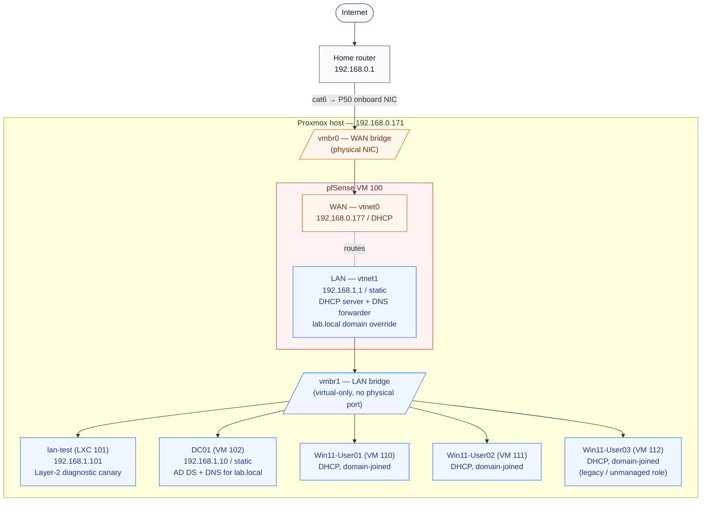

# Network topology

## Current state (post-Project-0 partial)

A flat lab LAN behind pfSense. All VMs share `192.168.1.0/24`. VLAN segmentation is deferred — see "Planned" section below.



## Planned state (after VLAN segmentation lands)

Once a managed switch is added (or full virtual-VLAN config in Proxmox), the LAN becomes four routed segments behind pfSense, with inter-VLAN traffic blocked by default and explicit allows per detection-engineering need:

```
WAN ─── pfSense ─┬── MGMT VLAN 10 (Proxmox host, admin workstation)
                 ├── CORP VLAN 20 (DC01, Win11-User01-03, file server)
                 ├── SEC  VLAN 30 (Wazuh, TheHive, MISP, Velociraptor, Cortex)
                 └── DMZ  VLAN 40 (Honeypots, exposed services, sandbox)
```

## Address plan

| Segment | CIDR | Purpose | Examples |
|---|---|---|---|
| WAN (home network) | `192.168.0.0/24` | Upstream of pfSense | Home router `.1`, Proxmox `.171`, pfSense WAN `.177` |
| LAN (current flat) | `192.168.1.0/24` | All lab traffic | pfSense LAN `.1`, DC01 `.10`, lan-test `.101`, DHCP pool `.100–.245` |
| MGMT VLAN 10 (planned) | `10.10.10.0/24` | Out-of-band management | Proxmox host, admin jump box |
| CORP VLAN 20 (planned) | `10.10.20.0/24` | Endpoints + AD | DC01, Win clients, file server |
| SEC VLAN 30 (planned) | `10.10.30.0/24` | SOC tooling | Wazuh, MISP, TheHive, Velociraptor, Cortex |
| DMZ VLAN 40 (planned) | `10.10.40.0/24` | Honeypots, sandbox | T-Pot, malware detonation chamber |

## Why no physical second NIC

The lab host (Lenovo P50) has one onboard Gigabit Ethernet. A USB-Ethernet dongle could provide a second physical NIC for a true two-arm pfSense deployment, but:

- All current and planned lab VMs are virtual — no physical devices need to land on the lab LAN
- A virtual-only bridge (`vmbr1` with no port) is functionally equivalent for VM-to-VM traffic and for pfSense routing between WAN and LAN
- Avoiding the USB-NIC dependency means no additional driver fragility, no lost connectivity if the dongle is unplugged

A physical second NIC will be added if/when real hardware (e.g. a Raspberry Pi running additional services, a managed switch) needs to participate in the lab network.
